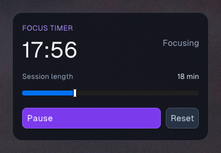
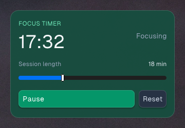

# Lane B results: state-preserving dev hot swap and widget logs

Lane B replaces `weaver dev`'s kill-and-respawn loop with an in-process,
transactional QuickJS handoff. Ordinary source edits keep the same process,
native window, retained state, and provider connection. Manifest changes still
take the explicit supervisor restart path because they can alter native window
construction.

## Mechanism

- A dev registration makes `weaverd` launch `weaver-widget --dev <dist>`.
  The runtime adds one native 100 ms timer that checks `bundle.js`'s mtime;
  there is no new IPC channel or background JS polling loop.
- The CLI checks and builds into temporary files, then atomically renames the
  completed bundle and manifest. A failed check/build never changes `dist`, so
  the old widget keeps running. It signals the host only when the manifest has
  changed; normal saves are consumed in place by the runtime.
- Reload capture serializes the root component's positional hook slots. A new
  QuickJS context evaluates against a private retained tree while sharing the
  process's single host-provider pipe client. Matching state/ref slots seed the
  new root; effects and non-serializable callback refs use their new bundle
  values. A count/kind/type mismatch discards that candidate and evaluates a
  wholly fresh one.
- Only after evaluation and hook validation succeed does the runtime exchange
  the live engine/tree pointers and dispose the old context. An evaluation
  failure therefore cannot mutate the visible tree or retire the old engine.

## Same-window state proof

The real `examples/pomodoro` widget was started through `weaver dev`, its Start
button was pressed, and the window was captured with PowerShell
`Graphics.CopyFromScreen`. The edit changed only the card, label, and button
colors.





The before capture reads **17:56** and the after capture **17:32**. Both
`WindowFromPoint` probes returned HWND **572396584**, owned by
`weaver-widget` PID **54132**. The runtime log for the edit was:

```text
[2026-07-14 09:47:08.512] info: dev hot swap applied (preserved root hook state)
```

The unchanged HWND proves that the native window was not recreated; the lower
countdown proves the running state continued rather than resetting.

## Failure and fallback gates

- A deliberate `const broken: number = "type error"` save printed
  `TS2322: Type 'string' is not assignable to type 'number'`. PID 55876 stayed
  alive and `dist/bundle.js` retained its prior 09:41:08 mtime. Removing the
  error produced the next successful in-place swap.
- Adding `useState(0)` above the Pomodoro hooks kept PID 55876 alive and logged
  `dev hot swap applied (fresh root hook state)` at 09:42:17.150. Removing it
  also remounted cleanly. This exercises the all-or-nothing slot-count rule.
- Changing config size from `[320, 210]` to `[340, 210]` printed
  `weaver dev restarted widget: window config changed` and changed the runtime
  PID from 55876 to 32640. Restoring the size used the same clean restart path.

## Logs

Every runtime initializes
`%LOCALAPPDATA%\weaver\logs\<widget-name>.log`. The custom runtime logger
captures native `std.log`, `native.log`, JS `console.log/warn/error`, uncaught
QuickJS exceptions, hot-swap outcomes, and renderer backend transitions.
Files append across hosted/dev launches and rotate before a write would cross
1 MiB, retaining one `.old` file.

Hosted `Clock` runs produced all three JS paths:

```text
[2026-07-14 09:43:40.982] info: widget: lane B native.log proof
[2026-07-14 09:44:15.398] info: widget: lane B --follow live proof
[2026-07-14 09:44:35.435] error: widget JavaScript exception: Error: lane B uncaught exception proof
[2026-07-14 09:45:56.069] info: widget console: lane B console proof
```

`weaver logs Clock --follow` was running as PID 61688 before the 09:44:15
restart; its redirected stdout received the new runtime start, `native.log`,
and renderer lines live. `weaver logs Clock` prints the last 200 lines from the
retained `.old` plus current file.

For rotation, a synthetic append grew `Clock.log` to **1,101,242 bytes**.
Starting a clean hosted Clock rotated it to `Clock.log.old` at that exact size
and created a new **262-byte** `Clock.log`, proving the one-backup 1 MiB path.

## Mechanical verification

Run from the repository root with Zig 0.16.0 on `PATH`:

```powershell
npm run build
npm test
npm run typecheck
cd runtime
zig build test -Doptimize=ReleaseFast -Dweb-layer=exclude -Dtrace=off
zig build -Doptimize=ReleaseFast -Dweb-layer=exclude -Dtrace=off
cd ../host
zig build test -Doptimize=ReleaseFast
zig build -Doptimize=ReleaseFast
```

All passed. `git -C runtime/native-sdk status --short` was empty, and all
`weaverd`, `weaver-widget`, `weaver-renderer`, dev CLI, and log-follow
processes were stopped after verification.
