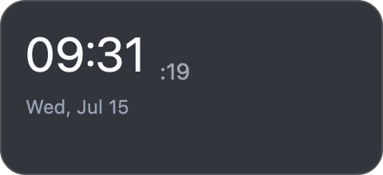

# macOS M12 — CI, regression matrix, and developer-build closure

Recorded 2026-07-15 on a MacBook Air with Apple M2 (8 cores, 8 GB), macOS
26.5.1 (25F80), arm64, Zig 0.16.0, Node 23.11.0 locally, and Node 22 in CI.
The implementation under test is Weaver commit `359be90` on
`macos/16-ci-regression-closure`, pinned to Native SDK commit `9cb7cd98` at
capture time. The branch has since advanced the pin to Native `91949e15`
(Dock-icon fix, texture-only raster cache, renderer CPU/memory reduction); the
required CI matrix, including the clean-checkout session job, re-passed at that
final head.
Machine-readable gate state is in
[`macos-m12-data.json`](macos-m12-data.json).

## Closure capability

The release workflow now separates three bills and failure domains:

- Windows `gate` builds/tests the runtime and host, runs the portable artifact
  lifecycle, checks every example surface, and audits the release contract.
- `macOS headless (apple-silicon|intel)` builds/tests the platform seam,
  runtime, signed 14.2 host, portable artifact lifecycle, eight examples,
  nonvisual daemon recovery, public media decision probe, and both Native SDK
  profiles.
- `macOS session (apple-silicon)` starts from a clean checkout, repeats the
  documented release builds, records display capability, then runs real AppKit
  Widgets through dev hot swap, providers, crashes, recovery, and teardown.

The release audit fails if platform implementation language enters the public
SDK, production code references private MediaRemote, a completed-port allowance
returns, build products become tracked, the Native SDK pin moves, the host
bundle identity/floor/usage description drifts, or a required CI surface is
removed.

macOS media closure is machine-readable rather than implied: status reports
`mediaAvailability: "unavailable"` and the number of subscribers, while a
media-only Now Playing Widget receives no fabricated frame and allocates no
provider socket, reader thread, or provider timer. Windows continues to report
the existing provider as `available`.

## Current automated evidence

| Gate | Local result | CI responsibility |
|---|---:|---|
| `npm run build`, `npm run typecheck`, `npm test` | PASS; 22/22 | Windows + both Mac architectures |
| `npm run audit:release` | PASS | Windows + both Mac architectures |
| Runtime platform services, full tests, ReleaseFast build | PASS | Both Mac architectures; Windows equivalents in `gate` |
| Host tests/build, strict codesign, bundle ID, minimum 14.2 | PASS | Both Mac architectures |
| Portable pack/inspect/install/rollback/replace/log/follow/uninstall | PASS | Windows + both Mac architectures |
| Eight checked-in example surfaces check and bundle | PASS | Windows + both Mac architectures |
| Public Now Playing observation/negative compile probe | PASS | Both Mac architectures |
| Native SDK stock and Widget profiles | PASS | Both Mac architectures |
| Nonvisual singleton/crash replacement/cleanup | PASS | Both Mac architectures |
| Real AppKit dev/provider/crash/teardown smoke | PASS | Apple-silicon session job |

The exact `359be90` implementation commit also passed a fresh source-checkout
Quickstart on this Mac: recursive clone at Native `9cb7cd98`, `npm ci`, both
ReleaseFast builds, `init`, `check`, real Metal `dev`, Ctrl-C teardown,
`pack`, `inspect`, `.weave` install, `uninstall Myclock`, `down`, and the
release audit. No process remained. The earlier `8a473bf` CI run passed the
Windows gate, both macOS headless architectures, and the Apple-silicon AppKit
session; the final documentation/pin head repeats the same required workflow.

The final local session required a current host rebuild after branch switching.
The first attempt correctly timed out because an older PR13 binary did not
contain `mediaAvailability`; `zig build` on the PR16 checkout replaced it and
the complete smoke passed. CI always builds from its clean checkout before the
session gate, so it cannot reuse that stale local binary.

The closure rerun also exposed a race in PR13's injected revocation assertion:
it sampled the frame counter while live frames were still in flight. PR13 fix
`2001014` now waits for the revoked state, then proves the counter remains
stable for a later status interval. The unit gate still proves the loss path
emits exactly one final zero.

Permissioned screen capture then exposed a defect that automation's old
`gpu_nonblank` assertion could not see: the retained Metal texture contained
the Clock, but the AppKit presenter had never initialized its texture pipeline
or sampler and therefore cleared the real drawable to near-white. Native PR #6
now initializes the presenter before the compositor and requires the dashboard
drawable sample to be `0xff171717`. A second physical issue was the provisional
desktop-icon-minus-one level flattening transparent windows against white;
wallpaper-plus-one retains the same below-Finder-items policy and composes the
premultiplied Clock correctly. The standalone WebView example now links the
same embedded metallib as generated applications.

## Required functional and reliability matrix

| Surface | Result and evidence |
|---|---|
| Clock / Conjure / dev | PASS — init, check, bundle, real dev launch, state-preserving source hot swap, manifest-triggered restart, Ctrl-C cleanup |
| Pomodoro / input / assets | PASS automated contract — example check/bundle plus SDK/Native button, slider, image, pointer, and retained-generation tests; prior physical input evidence remains in M1/M6 |
| System | PASS — one host sample fans out to two real Widgets; final subscriber parks collection |
| Now Playing | PASS unavailable behavior — real Widget remains in its no-data UI state, explicit diagnostic, zero frames/endpoints; production provider intentionally omitted |
| Visualizer | PASS deterministic production seam — two real Widgets, one capture, FFT/fan-out, silence/final-zero/resume/revoke/reauthorize/device recovery/teardown |
| DPI/placement and renderer parity | PASS automated fixtures and prior physical primary-display evidence; external displays remain physical `UNVERIFIED` |
| Artifact lifecycle | PASS — init/check/bundle/pack/inspect, directory and `.weave` install, atomic replacement, forced post-publish rollback, abandoned-stage cleanup, uninstall |
| Host lifecycle | PASS — up/down/status JSON, logs/logs-follow, acknowledged reload, concurrent writers, malformed-registry rejection/recovery, stale singleton/socket recovery |
| Failure recovery | PASS available automation — Widget and host SIGKILL, validated orphan cleanup, backoff/restart, renderer fallback/recovery, audio permission/device injection, zero remnants |
| Network/storage | PASS — HTTPS origin/cap/timeout/redirect/TLS/cancellation suite, exact 64 KiB storage quota, persistence/rotation, and idle-lazy network behavior |

The matrix does not pretend every brief item is newly exercised by one giant
test. It turns stable headless/session commands into CI and keeps expensive
measurements and physical desktop behavior in their recorded milestone gates.

## Performance closure

This PR makes no new performance claim. It preserves the M5–M10 raw ledgers:
1/3/10 static and mixed Widgets, 1/3 sustained 60 Hz, software/Metal/hybrid/
shared candidates, 10-minute active and static runs, 20 lifecycle iterations,
host/provider subscribed and unsubscribed cost, and active/silent Visualizers.
The selected retained Metal path, software fallback, and host-owned provider
lifetime are unchanged. The quiet Widget remains roughly 100–110 MB physical
footprint rather than meeting the aspirational 15 MiB investigation target;
that miss is explicit and not relabeled as Windows `PrivateUsage` parity.

## Physical and distribution gates

| Gate | State | Exact boundary |
|---|---|---|
| Primary Retina placement / four anchors / Mission Control trigger | PASS | M1–M3 correlated AppKit/CG/log evidence; final Clock is 240 x 110 points / 480 x 220 pixels with transparent corner RGBA `0,0,0,0` |
| Full OS screen recording | PASS | User-granted permission; fresh Chronicle frame plus direct 3420 x 2224 `screencapture` succeeded |
| External displays on every side and reconnect | UNVERIFIED | Only the integrated display is attached |
| Show Desktop | PASS | System Events key 103 exposed the production Metal Clock beneath Finder items and restored the prior frontmost app; attached OS recording |
| Stage Manager, Space switching, fullscreen, lock/unlock | UNVERIFIED | Stage Manager is disabled and the remaining desktop/session transitions were not exercised |
| Sleep/wake | UNVERIFIED | Unsafe to sleep the only unattended machine without a guaranteed wake path |
| Real System Audio Recording consent/mix | PASS | Signed spike captured 240,640 real 48 kHz mono frames; production authorization and Visualizer audible → silence → park → resume passed |
| Real permission revoke/default-route loss/recovery | UNVERIFIED | The permission remained granted and only integrated output was attached |
| Bluetooth / AirPlay | UNVERIFIED | No physical route is attached |
| Physical Intel runtime/performance | UNVERIFIED | Intel CI is build/headless only |
| Instruments / whole-SoC energy | UNVERIFIED | `xctrace` is AMFI-blocked; `powermetrics` requires privilege |
| Developer ID, notarization, App Sandbox, universal installer/login item | OUT OF SCOPE | Initial distribution is the ad-hoc-signed source-checkout developer build |

[Show Desktop OS recording](macos-m12-show-desktop.mov) demonstrates the real
desktop transition, correctly composited transparent Clock, and restoration.

The implementation, automated regression stack, real integrated-display/audio
paths, and reproducible developer handoff are closed. Hardware- or
session-dependent claims still listed as `UNVERIFIED`, plus the deliberately
out-of-scope distribution work, remain open rather than inferred.

Rollback is this Weaver PR: remove the explicit media diagnostic/idle path,
release audit, split CI/session gates, and documentation while retaining the
PR14 shipping decision and every earlier capability. There is no PR15. The
top branch is the handoff entry point.
