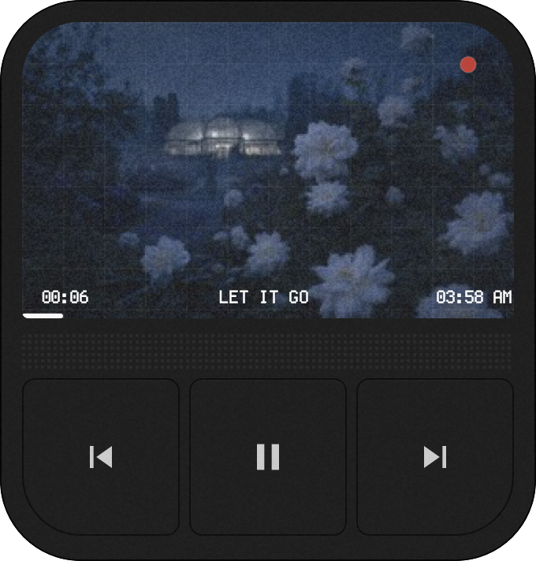
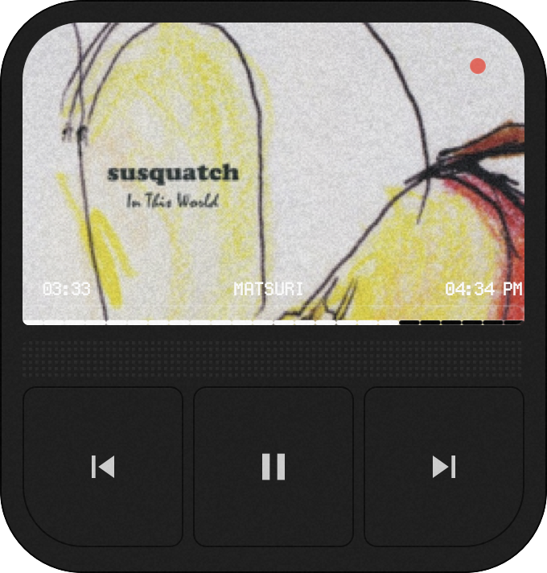

# Media PR 05 attended-Mac verification

Date: 2026-07-26

Branch: `media/05-mac-verify`

Stack head verified: `0d3f16311f728c969ea87a91e256e0de42cd7c3a`

Machine:

- M2 Mac (`arm64`)
- macOS 26.5.1 (25F80)
- Zig 0.16.0
- Node.js 23.11.0
- npm 11.3.0
- CMake 4.4.0

Decision: **PASS WITH ONE REMAINING ATTENDED GAP.**

The macOS provider, transport channel, lifecycle recovery, idle behavior,
Noro UI, and channel recovery all passed after fixing four live-only defects
found during this run. A 2x podcast session was not available on this Mac, so
the non-1x playback-rate attended check remains explicitly unverified.

## Preflight and build

`git pull --ff-only` fast-forwarded local `master` from `c579c03` to
`b1199b5`. Verification then branched from the exact handoff head `0d3f163`.
No stack branch or `master` was modified.

The current PR #35 and #36 Actions runs were cancelled during checkout rather
than failing a build or test. Local verification was therefore authoritative
for this run.

The first host build found that CMake was missing. CMake 4.4.0 was installed
with Homebrew, after which all expected build and test commands passed:

```text
npm ci
npm test                                      # 63 passed, 0 failed
npm run typecheck
node cli/bin/weaver.js check examples/noro-shell

cd runtime
zig build test -Dweb-layer=exclude -Dtrace=off
zig build -Doptimize=ReleaseFast

cd host
zig build test
zig build -Doptimize=ReleaseFast
```

The runtime stalled-send test prints its expected deadline warning. The host
peer-authentication test prints its expected rejected-PID warning. Both test
commands exited successfully.

## Defects found and fixed

1. The long-lived adapter stdout reader used `readSliceShort` with a 64 KiB
   buffer. A valid newline-terminated Spotify frame smaller than 64 KiB
   blocked until EOF, so live metadata never arrived. The worker now consumes
   bytes made available by `poll(2)` with `posix.read`.
2. The host command endpoint and runtime acknowledgement reader made the same
   mistake on persistent Unix sockets (512-byte and 4 KiB buffers). Ordinary
   commands and short acknowledgements waited for a full buffer, producing
   `MediaCommandTimeout`. Both sides now use `posix.read`, and socket teardown
   uses shutdown-before-join ownership rather than close-vs-read races.
3. The macOS host fed `CLOCK_MONOTONIC` time into a provider whose worker uses
   Zig's awake clock. Their different epochs made every new helper appear
   roughly 15 hours overdue, so the watchdog killed it immediately. The
   provider supervision tick now uses one clock domain.
4. Noro's seek control was only three pixels tall and its painted descendants
   won hit-testing, making the control effectively impossible to press. The
   visible strip remains three pixels, with a transparent 12-pixel button
   layered above it. A hardware pointer press produced the runtime
   down/up events after this fix.

Regression tests were added for a short adapter frame while the helper remains
open, a short command while the widget remains connected, and a short
acknowledgement while the host remains connected.

## Acceptance results

| Item | Result | Evidence |
|---|---|---|
| 1. Build + daemon, metadata, artwork | **PASS** | ReleaseFast builds passed. Spotify metadata appeared in under one second and `mediaPipeFrames` advanced. Real artwork files appeared in `~/Library/Caches/weaver/art`; 12 unique files were present. The live session did not naturally exceed 32 unique works, while the passing host test covers pruning to 32 and preservation of the just-published hash. |
| 2. Transport and seek honesty | **PASS** | The live widget returned `true` for pause, play, next, and previous, and the player state/title visibly changed. Seek against a MediaRemote session returned `true` and landed at 30,000 ms. With Music, QuickTime, and Spotify closed, the same widget seek returned `false` with canonical empty media state. Spotify itself declines system-level seek; Weaver correctly preserves that `false`. |
| 3. Helper/player lifecycle | **PASS, RATE GAP** | Killing helper PID 51721 emitted unavailable state, then helper PID 52864 appeared on bounded backoff and frames resumed (208 to 218). Quitting Spotify produced `null` metadata and frames 234 to 237; relaunch restored live metadata and frames reached 244. A podcast app/session reporting 2x was not available, so the attended non-1x check remains **NOT RUN**. |
| 4. Paused/silent idle-zero, 65 s | **PASS** | Host CPU time moved 1.25 s to 1.47 s (about 0.34% of one core); widget CPU time moved 0.62 s to 0.86 s (about 0.37%). Samples sat at 0.0-0.2% host and mostly 0.0% widget between heartbeat work. Frames 316 to 383 confirm the expected roughly 1 Hz heartbeat, not the fixed 10 Hz stream-worker wakeup. |
| 5. Noro macOS visual/interaction gate | **PASS** | Direct window captures were opened and inspected. Live artwork fills the screen area; elapsed time, uppercase title, clock, segmented progress, grille, and three controls are visible. The red REC dot is present while playing and absent while paused. The center, next, and previous controls changed real player state/tracks. The widened progress overlay receives hardware pointer events and dispatches the already-verified honest seek path. |
| 6. Runtime channel-failure recovery | **PASS** | With host PID 62774 stopped, widget PID 62783 received `MediaCommandTimeout`. After `SIGCONT`, the same widget process accepted a subsequent play command with `ok=true`; it was not permanently stranded. |
| Secondary: drag and persistence | **PASS** | OS-owned drag moved Noro from `(913,103)` to `(713,203)`. After killing runtime PID 81356 and automatic restart as PID 97926, the window reopened at `(713,203)`. |

## Visual evidence

The reference is the Windows Rainmeter capture; Rainmeter does not run on
macOS. The Mac capture is a direct capture of the real Weaver window, not a
mock or crop from the reference.

| Windows reference | macOS live provider |
|---|---|
|  |  |

In the live Mac capture, `MATSURI` is playing with its real album art, elapsed
time `03:33`, a filled segmented strip, pause glyph, and red REC dot.


The paused capture visibly shows real `おやすみ` artwork and metadata, a stable
`00:04` elapsed value, the play glyph, and no red REC dot.

## Remaining attended work

Run one podcast at 2x in an application whose MediaRemote payload reports
`playbackRate: 2`, then confirm Noro's elapsed value advances by two seconds per
wall-clock second. No product failure was observed for this path; the required
local media session was unavailable during this run.
