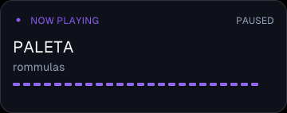
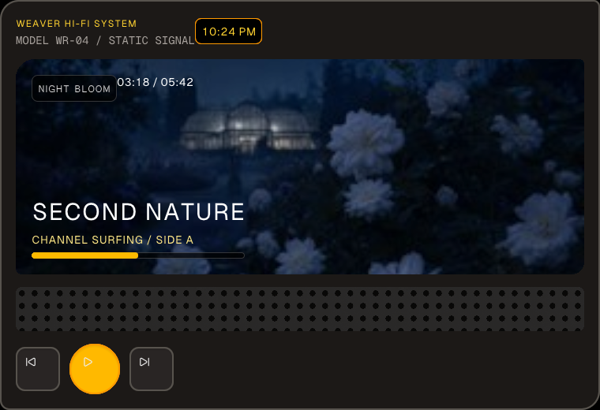

# Styling breadth results

Run date: 2026-07-21 on Windows 11. Both stacks remain unmerged draft-PR
stacks. Weaver is based on `master`; Native is based on `weaver-main`.

## Stack summary

| Layer | Weaver draft | Native draft |
|---|---|---|
| 01 / N1 | [#19 spacing and sizing](https://github.com/SunkenInTime/weaver/pull/19) | [#7 layout spacing](https://github.com/SunkenInTime/native/pull/7) |
| 02 / N2 | [#20 flex completeness](https://github.com/SunkenInTime/weaver/pull/20) | [#8 flex](https://github.com/SunkenInTime/native/pull/8) |
| 03 / N3 | [#21 radii and borders](https://github.com/SunkenInTime/weaver/pull/21) | [#9 radii and borders](https://github.com/SunkenInTime/native/pull/9) |
| 04 | [#22 Tailwind v4 palette](https://github.com/SunkenInTime/weaver/pull/22) | none |
| 05 / N4 | [#23 text pack](https://github.com/SunkenInTime/weaver/pull/23) | [#10 text](https://github.com/SunkenInTime/native/pull/10) |
| 06 / N5 | [#24 shadows](https://github.com/SunkenInTime/weaver/pull/24) | [#11 shadows and font seam](https://github.com/SunkenInTime/native/pull/11) |
| 07 | [#25 bundled fonts](https://github.com/SunkenInTime/weaver/pull/25) | rides N5 |
| 08 | [#26 Lucide icons](https://github.com/SunkenInTime/weaver/pull/26) | rides N5 |
| 09 / N6 | [#27 stack and overflow](https://github.com/SunkenInTime/weaver/pull/27) | [#12 stack and overflow](https://github.com/SunkenInTime/native/pull/12) |
| 10 / N7 | [#28 image v2](https://github.com/SunkenInTime/weaver/pull/28) | [#13 image v2](https://github.com/SunkenInTime/native/pull/13) |
| 11 / N8 | [#29 interaction](https://github.com/SunkenInTime/weaver/pull/29) | [#14 interaction](https://github.com/SunkenInTime/native/pull/14) |
| 12 | `styling/12-showcase` (draft link added after creation) | none |

## Acceptance anchor

`examples/retro-player-shell` is static and subscribes to no provider. It uses
the full stack in one retained tree: directional spacing and sizing, flex,
asymmetric radii, Tailwind colors, bundled font and tabular numerals, shadows,
Lucide icons, stack clipping, cover-fit local art, a generated tiled grille,
and native hover/pressed button channels. It has no interval, animated canvas,
media provider, fetch, or state loop.

The cover is the repository's Native deck `night-bloom.jpg`, reduced to
256×256 for the widget-profile decoded-image budget. `GeistPixel-Square.ttf`
and its OFL are reused from the repository's shipped font example. The grille
was produced with the built-in image generator as a seamless, flat two-color
perforated speaker grille; its generator metadata was removed and the fixed
1254×1254 canvas was normalized to a 256×256 nearest-neighbor tile. All three
assets remain local and portable.

## Windows A/B idle measurement

Same machine, release runtime and host, software renderer with pixels
presentation, isolated Weaver data roots, and one widget process at a time.
Each row is ten host `status.json` snapshots two seconds apart after startup;
CPU is Weaver host-reported process CPU percentage and memory is private MiB.
The parent was detached `origin/master` `a6d48af` with Native pin `78137351`.
The showcase was the final PR12 tree with Native pin `52c7627a`.

| Widget | Sample uptime | CPU avg (min–max) | Private MiB avg (min–max) |
|---|---:|---:|---:|
| master `examples/now-playing` | 46–69s | 0.859% (0.700–0.993%) | 23.626 (23.478–23.673) |
| PR12 `examples/retro-player-shell` | 56–75s | 0.576% (0.500–0.700%) | 28.217 (27.975–28.310) |
| delta | — | -0.283 percentage points (-32.9%) | +4.591 MiB (+19.4%) |

This is the brief-required product A/B, not a causal microbenchmark: the two
widgets have different dimensions and retained content. It demonstrates that
the static showcase reaches idle without polling or crash-restart; it does not
attribute the memory delta to any one styling layer.

## Physical captures

Master baseline (`examples/now-playing`):

Final acceptance anchor (`examples/retro-player-shell`):

Both are physical Windows software/pixels native-window captures made with
Win32 `PrintWindow` and visually inspected. The computer-control plugin's
native pipe was unavailable on this host. macOS physical pixels remain
`UNVERIFIED (needs Mac)`; headless CI is compile/test evidence, not a physical
pixel claim.

## Contract and verification

`sdk/CONTRACT.md` ends with consolidated element and class-family tables. The
imported `sdk/test/contract-tables.test.mjs` freezes the ordered row sets,
compiles a representative for every documented syntax branch, and proves
gradients, transitions, positioned layout, and unsupported state utilities
remain loud `UtilityError` failures. The complete command/evidence ledger,
assumptions, inherited Native fast-gate blocker, Mac-only unverified items,
and cleanup state live in `docs/styling-run-status.md`.
